English | [简体中文](README_ch.md) 


<div align="center">
  

A lightweight open-source web application firewall

[](https://github.com/samwafgo/SamWaf/releases)
[](https://github.com/samwafgo/SamWaf/releases)
[](https://hub.docker.com/r/samwaf/samwaf)
[](https://github.com/samwafgo/SamWaf/releases)
[](https://gitee.com/samwaf/SamWaf)
[](https://github.com/samwafgo/SamWaf)
[](https://gitee.com/samwaf/SamWaf)
[](LICENSE)
</div>

  
## Development Motivation:
- **Lightweight**: Initially, I used some security products  based on nginx, apache, and iis plugins for protection, but the plugin form had a high coupling degree.
- **Privatization**: Later, most cloud protection services were adopted, but private deployment is affordable only for medium and large enterprises, while small companies and studios find it costly.
- **Privacy Encryption**: During web protection, it is preferable to process local data without sending it to the cloud. The goal was to create a tool that encrypts local information and network communications for the management end.
- **DIY**: Over the years of website maintenance and development, there were specific functions I wanted to add but couldn't achieve.
- **Awareness**: If the webmaster has never used a similar WAF, it is inconvenient to understand who is accessing the site and what requests are being made solely from logs or nginx, apache, IIS, etc.

In short, the goal was to create an effective tool for website or API protection to handle abnormal situations and ensure the normal operation of websites and applications.

# Software Introduction
SamWaf is a lightweight, open-source web application firewall for small companies, studios, and personal websites. It supports fully private deployment, encrypts data stored locally, is easy to start, and supports Linux 、 Windows 64-bit and Arm64.

## Architecture


## Interface


<table>
    <tr>
        <td align="center">Add Host</td>
        <td align="center">Attack Log</td>
    </tr>
    <tr>
        <td>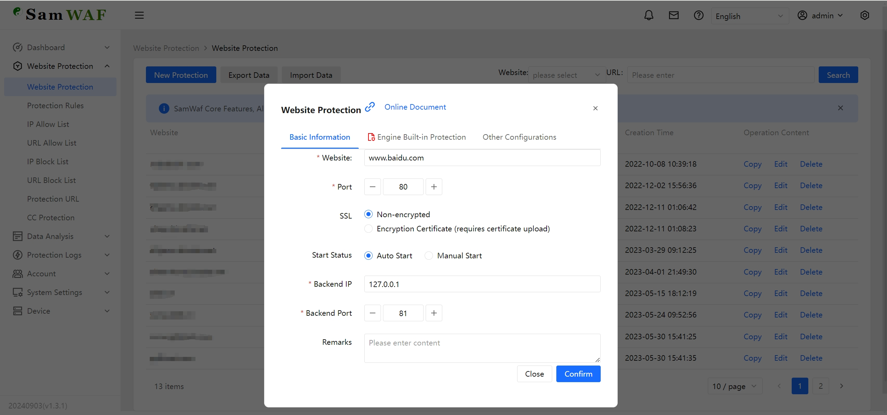</td>
        <td>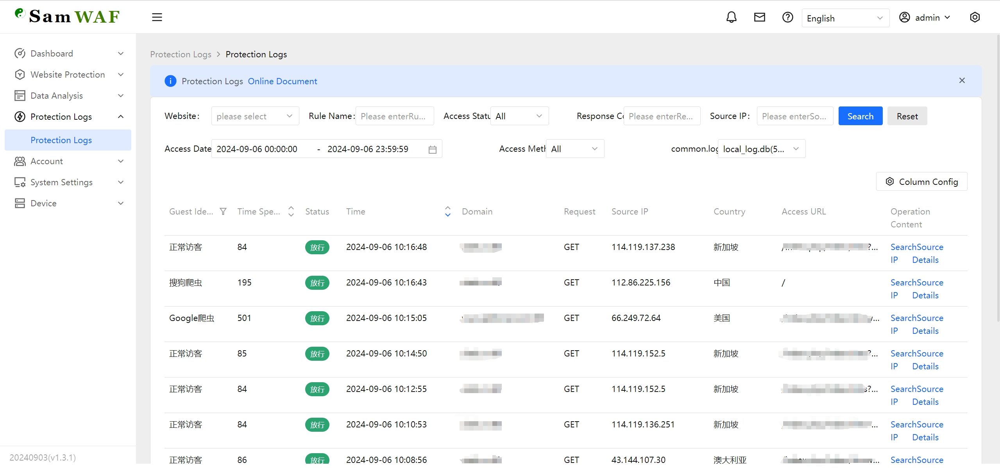</td>
    </tr>
    <tr>
        <td align="center">CC</td>
        <td align="center">IP Blocklist</td>
    </tr>
    <tr>
        <td>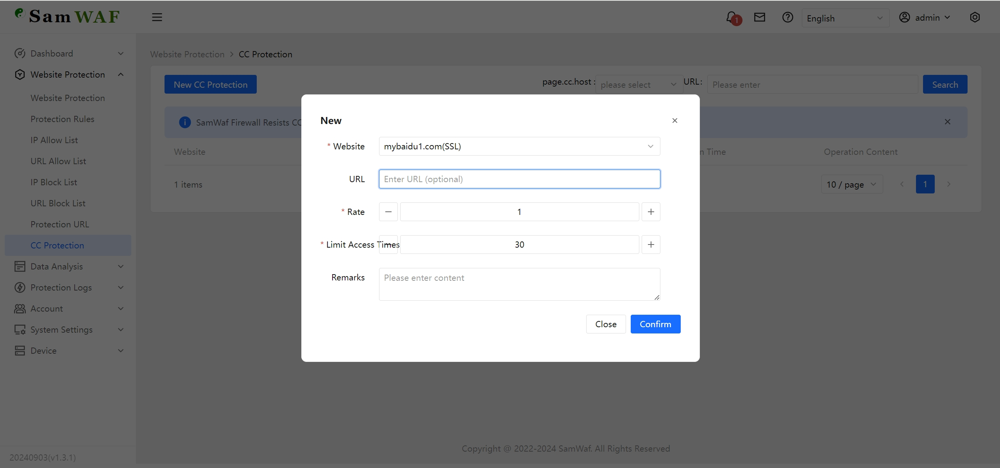</td>
        <td>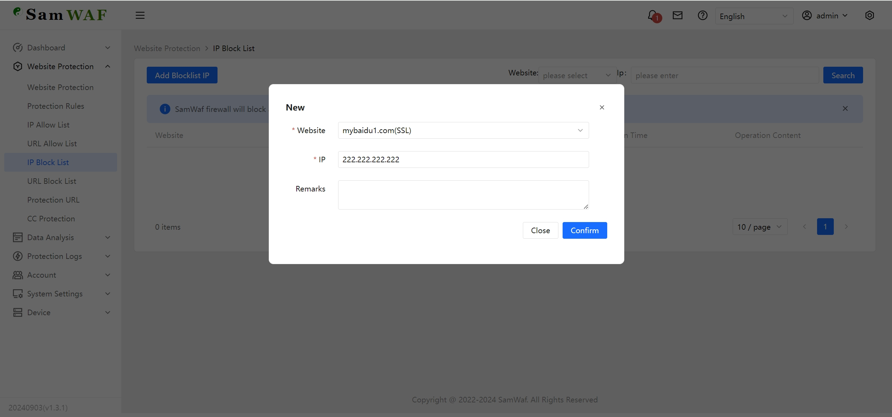</td>
    </tr>
    <tr>
        <td align="center">IP Allowlist</td>
        <td align="center">LDP</td>
    </tr>
    <tr>
        <td>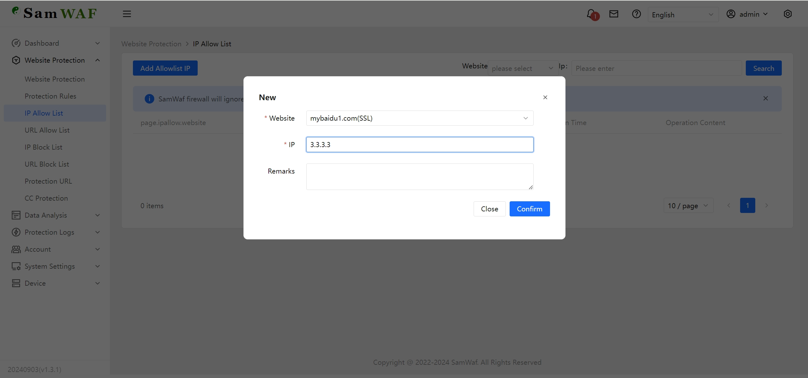</td>
        <td>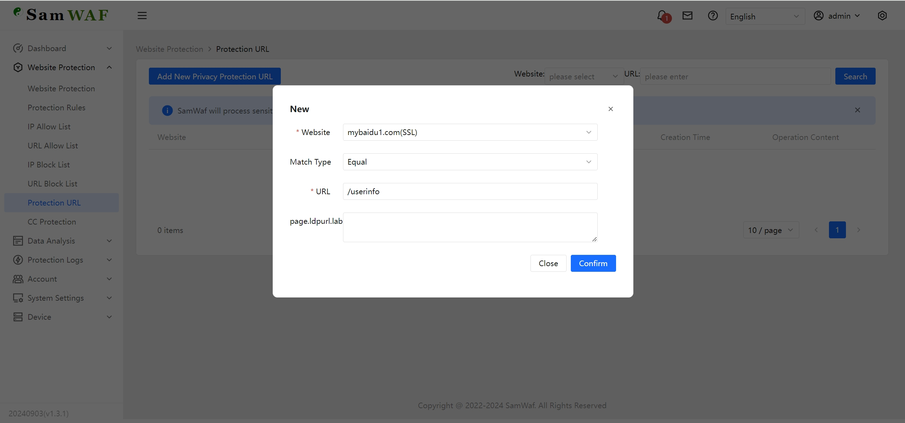</td>
    </tr>
    <tr>
        <td align="center">Add Rule Script Log</td>
        <td align="center">Select Log</td>
    </tr>
    <tr>
        <td>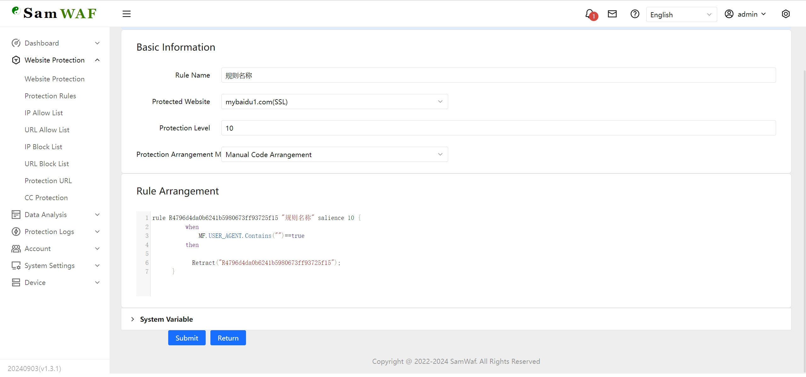</td>
        <td>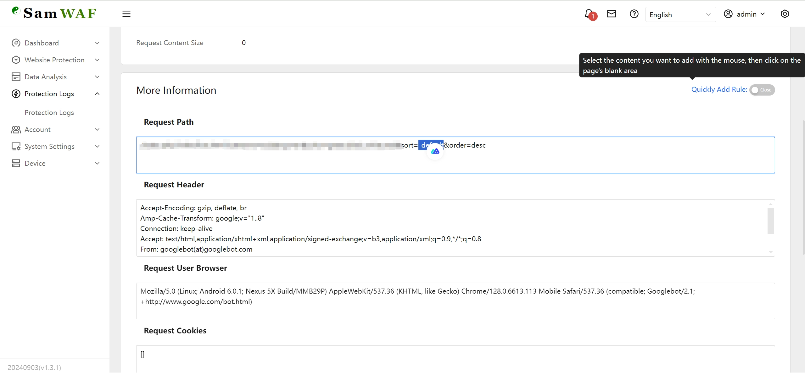</td>
    </tr>
    <tr>
        <td align="center">Log Details</td>
        <td align="center">Manual Rule</td>
    </tr>
    <tr>
        <td>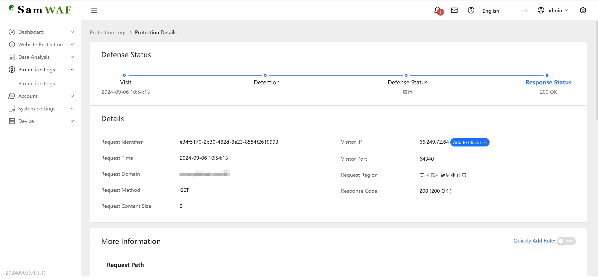</td>
        <td>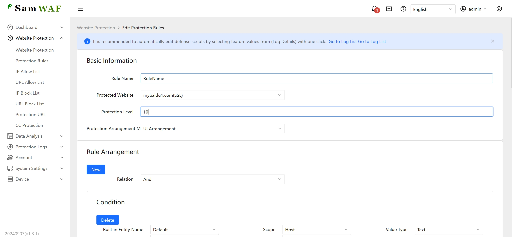</td>
    </tr>
    <tr>
        <td align="center">URL Blocklist</td>
        <td align="center">URL Allowlist</td>
    </tr>
    <tr>
        <td>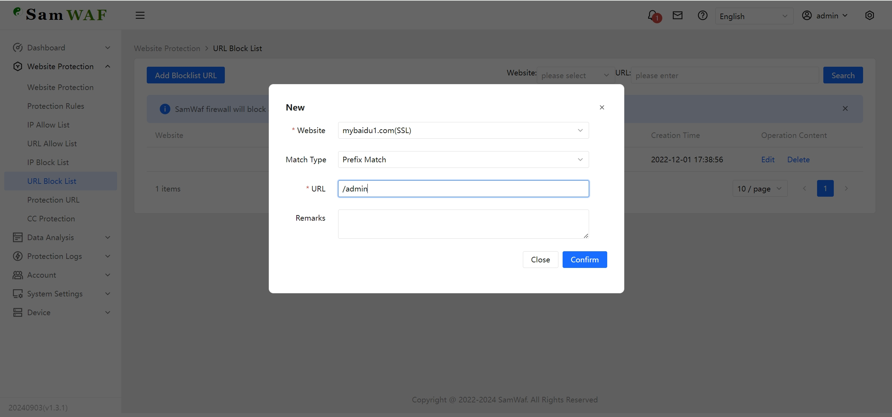</td>
        <td>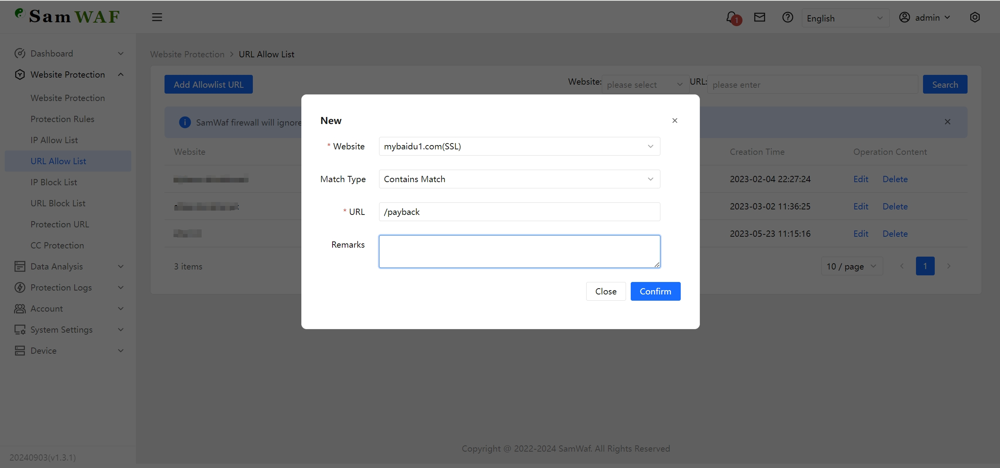</td>
    </tr>
</table>

## Main Features:
- Completely open-source code
- Supports private deployment
- Lightweight, no dependency on third-party services
- Fully independent engine, protection functions do not rely on IIS, Nginx
- Customizable protection rules, supporting both script and GUI editing
- Supports allowlist access
- Supports IP blocklist
- Supports URL allowlist
- Supports URL access restrictions
- Supports designated data privacy output
- Supports CC frequency access
- Supports global one-click configuration
- Supports separate protection strategies for different websites
- Encrypted log storage
- Encrypted communication logs
- Data obfuscation
- Supports global one-click configuration
- Supports OWASP CRS
- Automatic SSL certificate application and renewal
- Bulk SSL certificate expiration check
- IPv6 support
- Customizable blocking page

# Usage Instructions
**It is strongly recommended to conduct thorough testing in a test environment before deploying to production. If any issues arise, please provide feedback promptly.**
## Download the Latest Version
Gitee:  [https://gitee.com/samwaf/SamWaf/releases](https://gitee.com/samwaf/SamWaf/releases)

GitHub: [https://github.com/samwafgo/SamWaf/releases](https://github.com/samwafgo/SamWaf/releases)

## Quick Start

### Windows
- Start directly
```
SamWaf64.exe
```
- As a service As Administration
```
//Install & Start
SamWaf64.exe install && SamWaf64.exe start

//Stop &  Uninstall 
SamWaf64.exe stop && SamWaf64.exe uninstall
``` 

### Linux
- install
```
curl -sSO http://update.samwaf.com/latest/install_samwaf.sh && bash install_samwaf.sh install 
``` 

- uninstall
```
curl -sSO http://update.samwaf.com/latest/install_samwaf.sh && bash install_samwaf.sh uninstall 
```

### Docker
```
docker run -d --name=samwaf-instance \
           -p 26666:26666 \
           -p 80:80 \
           -p 443:443 \
           -v /path/to/your/conf:/app/conf \
           -v /path/to/your/data:/app/data \
           -v /path/to/your/logs:/app/logs \
           -v /path/to/your/ssl:/app/ssl \
           samwaf/samwaf


```
More Detail Docker https://hub.docker.com/r/samwaf/samwaf

Tags:
- **latest**: The latest stable release (recommended for production use).
- **beta**: The latest testing version (allows testing of new features or specific bug fixes).

## Start Access

http://127.0.0.1:26666

Default account: admin  Default password: admin868 (Please change the default password upon first login)


## Upgrade Guide

**Note: The upgrade process will terminate the service, please upgrade during off-peak hours.**

### Automatic Upgrade
If a new version is available, an upgrade prompt will pop up for confirmation, allowing you to initiate the upgrade. The page will automatically refresh after the upgrade is complete.

### Manual Upgrade
- For direct launch:
    1. Close the application.
    2. Download the latest program and replace the existing files, then manually start it again.

- For service mode:
```
1. First, pause the service.

  Windows: SamWaf64.exe stop
  Linux: ./SamWafLinux64 stop
  
2. Replace with the latest application files.

3. Start the service:
Windows: SamWaf64.exe start
Linux: ./SamWafLinux64 start
```

**Note**: Upgrading the Windows service may trigger security rules from 360 or Huorong, preventing the new files from being replaced normally. In this case, you can manually replace the files. Those familiar with this area can help determine the correct handling method.

## Online Documentation

[Online Documentation](https://doc.samwaf.com/)

# Code Information
## Code Repository
- Gitee
[https://gitee.com/samwaf/SamWaf](https://gitee.com/samwaf/SamWaf)
- GitHub
[https://github.com/samwafgo/SamWaf](https://github.com/samwafgo/SamWaf)

## Introduction and Compilation
How to Compile
[Compilation Instructions](./docs/compile.md)

Compile Online Manual：
[https://doc.samwaf.com/en/dev/](https://doc.samwaf.com/en/dev/)

## Tested and Supported Platforms
[Tested and Supported Platforms](./docs/Tested_supported_systems.md)

## Other Info 

- [Update IP Database](./docs/ipmodify.md)

## Testing Results
[Testing Results](./test/attackTest.md)

# Security Policy
[Security Policy](./SECURITY.md)

# Feedback
SamWaf is continuously iterating. We welcome feedback and suggestions.

- [Gitee Issues](https://gitee.com/samwaf/SamWaf/issues)
- [GitHub Issues](https://github.com/samwafgo/SamWaf/issues)
- Email feedback: samwafgo@gmail.com

# WeChat Public Account

 

## Star history

[](https://star-history.com/#samwafgo/samwaf&Date)


#  License
SamWaf is licensed under the Apache License 2.0. Refer to [LICENSE](./LICENSE) for more details.

For third-party software usage notice, see [ThirdLicense](./ThirdLicense)

# Contribution
 Thanks for the following contributors!

<a href="https://github.com/samwafgo/SamWaf/graphs/contributors">
  
</a>
