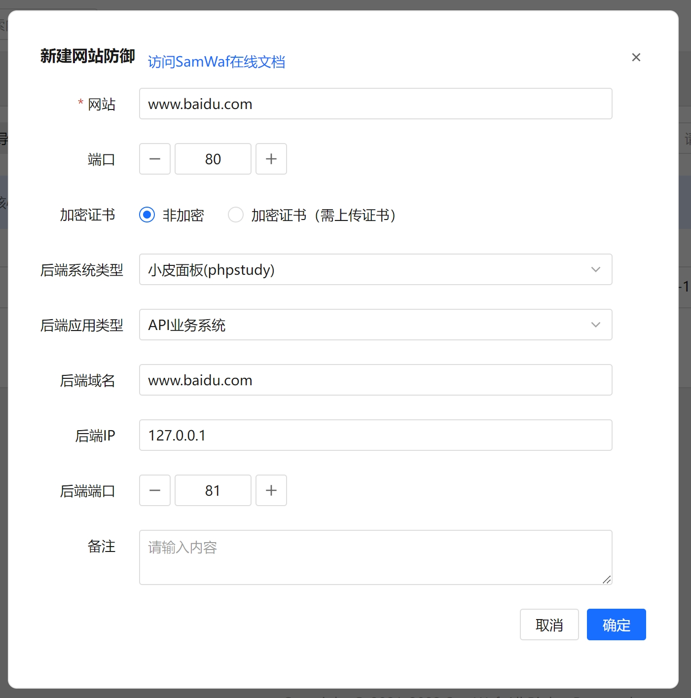
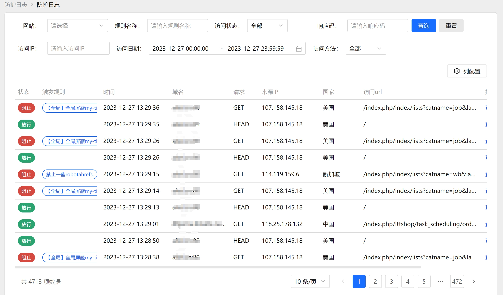
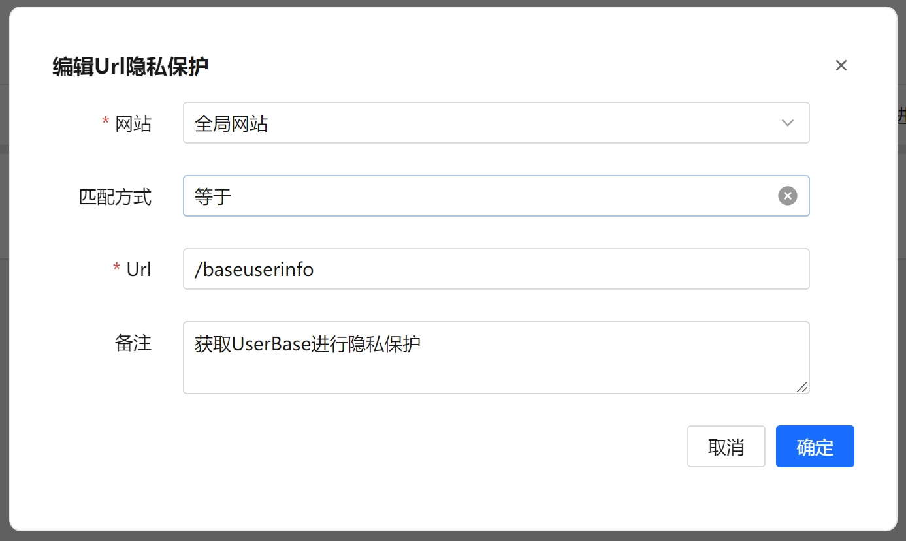
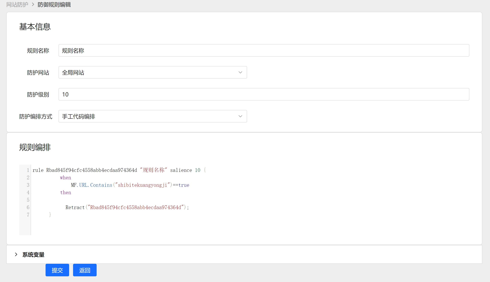
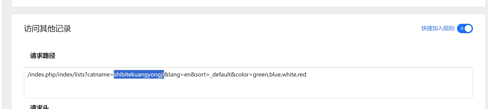
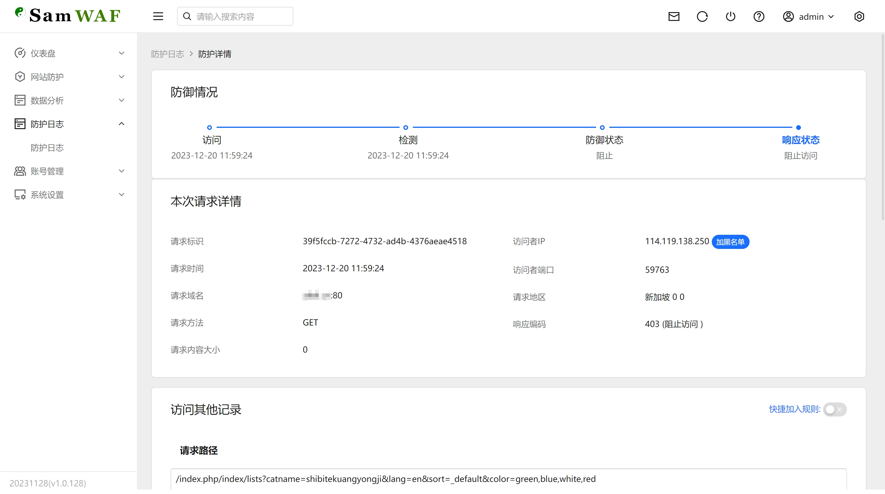
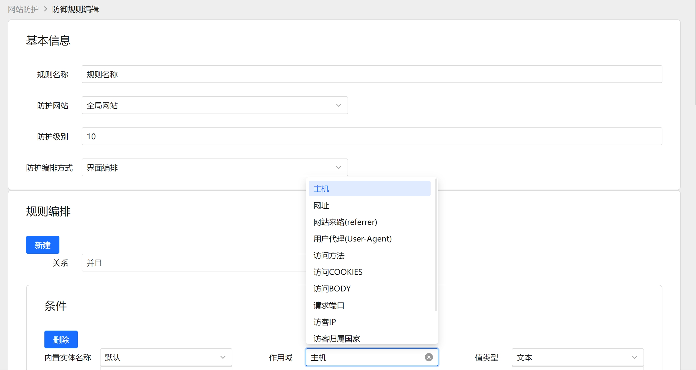
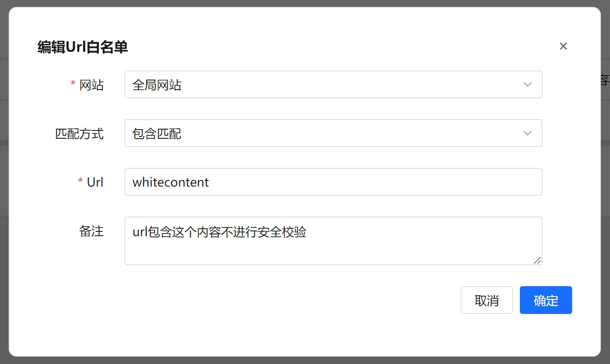

English | [简体中文](README_ch.md) 

# SamWaf Open Source Web Application Firewall
[](https://github.com/samwafgo/SamWaf/releases)

## Development Motivation:
- **Lightweight**: Initially, I used security products like Safe * and Yun* based on nginx, apache, and iis plugins for protection, but the plugin form had a high coupling degree.
- **Privatization**: Later, most cloud protection services were adopted, but private deployment is affordable only for medium and large enterprises, while small companies and studios find it costly.
- **Privacy Encryption**: During web protection, it is preferable to process local data without sending it to the cloud. The goal was to create a tool that encrypts local information and network communications for the management end.
- **DIY**: Over the years of website maintenance and development, there were specific functions I wanted to add but couldn't achieve.
- **Awareness**: If the webmaster has never used a similar WAF, it is inconvenient to understand who is accessing the site and what requests are being made solely from logs or nginx, apache, IIS, etc.

In short, the goal was to create an effective tool for website or API protection to handle abnormal situations and ensure the normal operation of websites and applications.

# Software Introduction
SamWaf is a lightweight, open-source web application firewall for small companies, studios, and personal websites. It supports fully private deployment, encrypts data stored locally, is easy to start, and supports Linux and Windows 64-bit.

## Architecture


## Interface


<table>
    <tr>
        <td align="center">Add Host</td>
        <td align="center">Attack Log</td>
    </tr>
    <tr>
        <td></td>
        <td></td>
    </tr>
    <tr>
        <td align="center">CC</td>
        <td align="center">IP Blacklist</td>
    </tr>
    <tr>
        <td></td>
        <td></td>
    </tr>
    <tr>
        <td align="center">IP Whitelist</td>
        <td align="center">LDP</td>
    </tr>
    <tr>
        <td></td>
        <td></td>
    </tr>
    <tr>
        <td align="center">Add Rule Script Log</td>
        <td align="center">Select Log</td>
    </tr>
    <tr>
        <td></td>
        <td></td>
    </tr>
    <tr>
        <td align="center">Log Details</td>
        <td align="center">Manual Rule</td>
    </tr>
    <tr>
        <td></td>
        <td></td>
    </tr>
    <tr>
        <td align="center">URL Blacklist</td>
        <td align="center">URL Whitelist</td>
    </tr>
    <tr>
        <td></td>
        <td></td>
    </tr>
</table>

## Main Features:
- Completely open-source code
- Supports private deployment
- Lightweight, no dependency on third-party services
- Fully independent engine, protection functions do not rely on IIS, Nginx
- Customizable protection rules, supporting both script and GUI editing
- Supports whitelist access
- Supports IP blacklist
- Supports URL whitelist
- Supports URL access restrictions
- Supports designated data privacy output
- Supports CC frequency access
- Supports global one-click configuration
- Supports separate protection strategies for different websites
- Encrypted log storage
- Encrypted communication logs
- Data obfuscation

# Usage Instructions
## Download the Latest Version
Gitee:  [https://gitee.com/samwaf/SamWaf/releases](https://gitee.com/samwaf/SamWaf/releases)

GitHub: [https://github.com/samwafgo/SamWaf/releases](https://github.com/samwafgo/SamWaf/releases)

## Quick Start
### Windows
- Start directly
```
SamWaf64.exe
```
- As a service
```
//Install
SamWaf64.exe install 

//Start
SamWaf64.exe start

//Stop
SamWaf64.exe stop

//Uninstall
SamWaf64.exe uninstall
```

### Linux

- Start directly
```
./SamWafLinux64
```
- As a service
```
//Install
./SamWafLinux64 install 

//Start
./SamWafLinux64 start

//Stop
./SamWafLinux64 stop

//Uninstall
./SamWafLinux64 uninstall
```
 


## Start Access

http://127.0.0.1:26666

Default account: admin  Default password: admin868 (Please change the default password upon first login)

## Online Documentation

[Online Documentation](https://doc.samwaf.com/)

# Code Information
## Code Repository
- Gitee
[https://gitee.com/samwaf/SamWaf](https://gitee.com/samwaf/SamWaf)
- GitHub
[https://github.com/samwafgo/SamWaf](https://github.com/samwafgo/SamWaf)

## Introduction and Compilation
How to Compile
[Compilation Instructions](./docs/compile.md)

## Tested and Supported Platforms
[Tested and Supported Platforms](./docs/Tested_supported_systems.md)

# Security Policy
[Security Policy](./SECURITY.md)

# Feedback
SamWaf is continuously iterating. We welcome feedback and suggestions.

- [Gitee Issues](https://gitee.com/samwaf/SamWaf/issues)
- [GitHub Issues](https://github.com/samwafgo/SamWaf/issues)
- Email feedback: samwafgo@gmail.com

#  License
SamWaf is licensed under the Apache License 2.0. Refer to [LICENSE](./LICENSE) for more details.

For third-party software usage notice, see [ThirdLicense](./ThirdLicense)

# Contribution
 Thanks for the following contributors!

<a href="https://github.com/samwafgo/SamWaf/graphs/contributors">
  
</a>