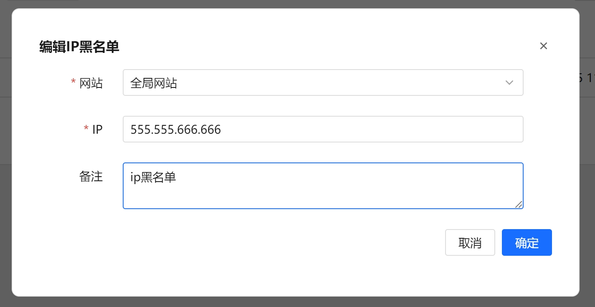
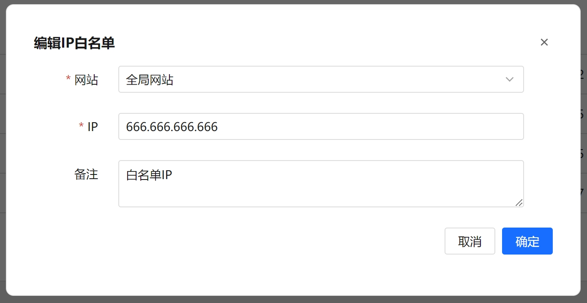
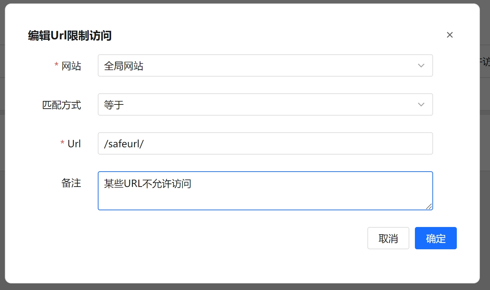

[English](README.md) | 简体中文


<div align="center">
  

一款开源轻量级的网站应用防火墙

[](https://github.com/samwafgo/SamWaf/releases)
[](https://gitee.com/samwaf/SamWaf) 
[](https://gitee.com/samwaf/SamWaf)
[](https://github.com/samwafgo/SamWaf)
[](LICENSE)
</div>

## 开发初衷:
- 【轻量】早期在使用过一些产品基于 nginx,apache,iis 做插件进行防护,但是插件形式耦合度太高了。
- 【私有化】 后期基本上都是有云防护，而私有化部署针对一般的中大企业能承受，普通小企业公司，小工作室费用有点太高了。
- 【隐私加密】 网站防护过程中不希望本地数据上云做处理，想做一款涉及的本地信息进行加密，管理端的网络通信进行加密。
- 【DIY】在这么多年网站维护开发过程中有些特定的功能想加入自己的想法，无法实现。
- 【感知】如果站长没有用过类似的 waf ，单纯从自己的日志或者是 nginx 、apache 、IIS 等查看信息不方便，不知道到底网站有谁在访问，都请求了什么？
 总之，在网站或 API 防护上做一款趁手的兵器，来抵御一些异常情况，确保网站和应用的正常运行。
 
# 软件介绍
SamWaf网站防火墙是一款适用于小公司、工作室和个人网站的开源轻量级网站防火墙，完全私有化部署，数据加密且仅保存本地，一键启动，支持Linux，Windows 64位,Arm64。

## 架构


## 界面


<table>
    <tr>
        <td align="center">添加主机</td>
        <td align="center">攻击日志</td>
    </tr>
    <tr>
        <td></td>
        <td></td>
    </tr>
    <tr>
        <td align="center">CC</td>
        <td align="center">IP黑名单</td>
    </tr>
    <tr>
        <td></td>
        <td></td>
    </tr>
    <tr>
        <td align="center">IP白名单</td>
        <td align="center">LDP</td>
    </tr>
    <tr>
        <td></td>
        <td></td>
    </tr>
    <tr>
        <td align="center">添加规则脚本日志</td>
        <td align="center">选择日志</td>
    </tr>
    <tr>
        <td></td>
        <td></td>
    </tr>
    <tr>
        <td align="center">日志详情</td>
        <td align="center">手动规则</td>
    </tr>
    <tr>
        <td></td>
        <td></td>
    </tr>
    <tr>
        <td align="center">URL黑名单</td>
        <td align="center">URL白名单</td>
    </tr>
    <tr>
        <td></td>
        <td></td>
    </tr>
</table>


## 主要功能：
- 代码完全开源
- 支持私有化部署
- 轻量化不依赖三方服务
- 完全独立引擎，防护功能不依赖IIS,Nginx
- 自定义防护规则，支持脚本和界面编辑
- 支持白名单访问
- 支持IP黑名单
- 支持URL白名单
- 支持限制URL访问
- 支持指定界面数据隐私输出
- 支持CC频率访问
- 支持全局一键配置
- 支持分网站单独防护策略
- 日志加密保存
- 通讯日志加密
- 信息脱敏保存
- 支持OWASP CRS规则集


# 使用说明
**强烈建议您在测试环境测试充分在上生产，如遇到问题请及时反馈**
## 下载最新版本
gitee:  [https://gitee.com/samwaf/SamWaf/releases](https://gitee.com/samwaf/SamWaf/releases)

github: [https://github.com/samwafgo/SamWaf/releases](https://github.com/samwafgo/SamWaf/releases)
 
## 快速启动
### Windows
- 直接启动
```
SamWaf64.exe
```
- 服务形式
```
//安装
SamWaf64.exe install 

//启动
SamWaf64.exe start

//停止
SamWaf64.exe stop

//卸载
SamWaf64.exe uninstall
```

### Linux

- 直接启动
```
./SamWafLinux64
```
- 服务形式
```
//安装
./SamWafLinux64 install 

//启动
./SamWafLinux64 start

//停止
./SamWafLinux64 stop

//卸载
./SamWafLinux64 uninstall
```


### Docker
```
docker run -d --name=samwaf-instance \
           -p 26666:26666 \
           -p 80:80 \
           -p 443:443 \
           -v /path/to/your/conf:/app/conf \
           -v /path/to/your/data:/app/data \
           -v /path/to/your/logs:/app/logs \
           -v /path/to/your/ssl:/app/ssl \
           samwaf/samwaf


```
更多docker启动上面的解释  https://hub.docker.com/r/samwaf/samwaf


## 启动访问

http://127.0.0.1:26666

默认帐号：admin  默认密码：admin868 (注意首次进入请把默认密码改掉)

## 升级指南

**注意:升级过程会终止服务,请在闲时进行升级。**

### 自动升级
如有新版本页面会弹出升级框进行确认即可发起升级，升级完毕后，页面会自动刷新。
### 手动升级
- 对于直接启动方式

关闭应用，下载最新程序替换,再手工启动就可以了。

- 对于以服务形式
```
1.先暂停服务

  windows: SamWaf64.exe stop
  linux: ./SamWafLinux64 stop
  
2.替换最新应用文件

3.启动
windows: SamWaf64.exe start
linux: ./SamWafLinux64 start
```

PS:windows服务形式升级时候貌似会触发360、火绒规则导致无法正常替换新文件。此时可以手工替换。
熟悉这方面的朋友可以帮看下正确方式怎么处理。

## 在线文档

[在线文档](https://doc.samwaf.com/)

# 代码相关
## 代码托管
- gitee
[https://gitee.com/samwaf/SamWaf](https://gitee.com/samwaf/SamWaf)
- github
[https://github.com/samwafgo/SamWaf](https://github.com/samwafgo/SamWaf)

## 介绍和编译
How to compile
[编译说明](./docs/compile.md)

在线编译手册：
[https://doc.samwaf.com/dev/](https://doc.samwaf.com/dev/)

## 已测试支持的平台
[已测试支持的平台](./docs/Tested_supported_systems.md)

## 其它信息

- [更新IP数据库](./docs/ipmodify.md)
 
## 测试效果
[测试效果](./test/attackTest.md)

# 安全策略
[安全策略](./SECURITY.md)

# 问题反馈
当前 SamWaf 还正在不停迭代,欢迎大家反馈问题、提出意见

- [gitee issues](https://gitee.com/samwaf/SamWaf/issues)
- [github issues](https://github.com/samwafgo/SamWaf/issues)
- 邮件反馈:samwafgo@gmail.com

## Star 历史趋势

[](https://star-history.com/#samwafgo/samwaf&Date)

# 许可证书
SamWaf 采用 Apache 2.0 license. 详细见 [LICENSE](./LICENSE) .

第三方软件使用声明，见[ThirdLicense](./ThirdLicense)
 
# 贡献代码
 感谢以下小伙伴对本仓库的贡献!

<a href="https://github.com/samwafgo/SamWaf/graphs/contributors">
  
</a>