[English](README.md) | [简体中文](README_cn.md) | [Español](README_es.md) | [हिन्दी](README_hi.md) | [العربية](README_ar.md) | [Français](README_fr.md) | [Português](README_pt.md) | [Русский](README_ru.md) | [বাংলা](README_bn.md) | [اردو](README_ur.md) | [日本語](README_ja.md) | [Deutsch](README_de.md) | [Bahasa Indonesia](README_id.md) | [한국어](README_ko.md)


<div align="center">
  

一款开源轻量级的网站应用防火墙

[](https://github.com/samwafgo/SamWaf/releases)
[](https://github.com/samwafgo/SamWaf/releases)
[](https://hub.docker.com/r/samwaf/samwaf)
[](https://github.com/samwafgo/SamWaf/releases)
[](https://gitee.com/samwaf/SamWaf) 
[](https://gitee.com/samwaf/SamWaf)
[](https://atomgit.com/SamSafe/SamWaf)
[](https://github.com/samwafgo/SamWaf)
[](LICENSE)
</div>

## 开发初衷:
- 【轻量】早期在使用过一些产品基于 nginx,apache,iis 做插件进行防护,但是插件形式耦合度太高了。
- 【私有化】 后期基本上都是有云防护，而私有化部署针对一般的中大企业能承受，普通小企业公司，小工作室费用有点太高了。
- 【隐私加密】 网站防护过程中不希望本地数据上云做处理，想做一款涉及的本地信息进行加密，管理端的网络通信进行加密。
- 【DIY】在这么多年网站维护开发过程中有些特定的功能想加入自己的想法，无法实现。
- 【感知】如果站长没有用过类似的 waf ，单纯从自己的日志或者是 nginx 、apache 、IIS 等查看信息不方便，不知道到底网站有谁在访问，都请求了什么？
 总之，在网站或 API 防护上做一款趁手的兵器，来抵御一些异常情况，确保网站和应用的正常运行。
 
# 软件介绍
SamWaf网站防火墙是一款适用于小公司、工作室和个人网站的开源轻量级网站防火墙，完全私有化部署，数据加密且仅保存本地，一键启动，支持 Linux、Windows 64位、ARM64，并提供 Docker 镜像。默认使用内置加密 SQLite 存储、无需安装任何外部依赖，也可按需切换 MySQL / PostgreSQL。

## 架构

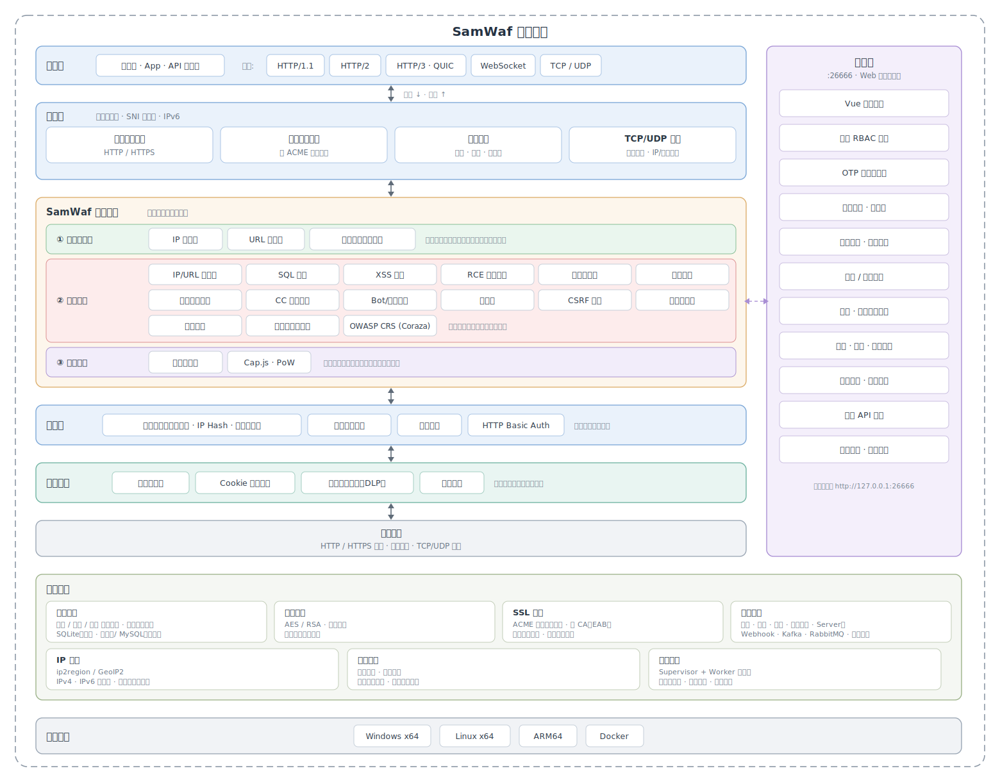

## 界面


<table>
    <tr>
        <td align="center">添加主机</td>
        <td align="center">攻击日志</td>
    </tr>
    <tr>
        <td>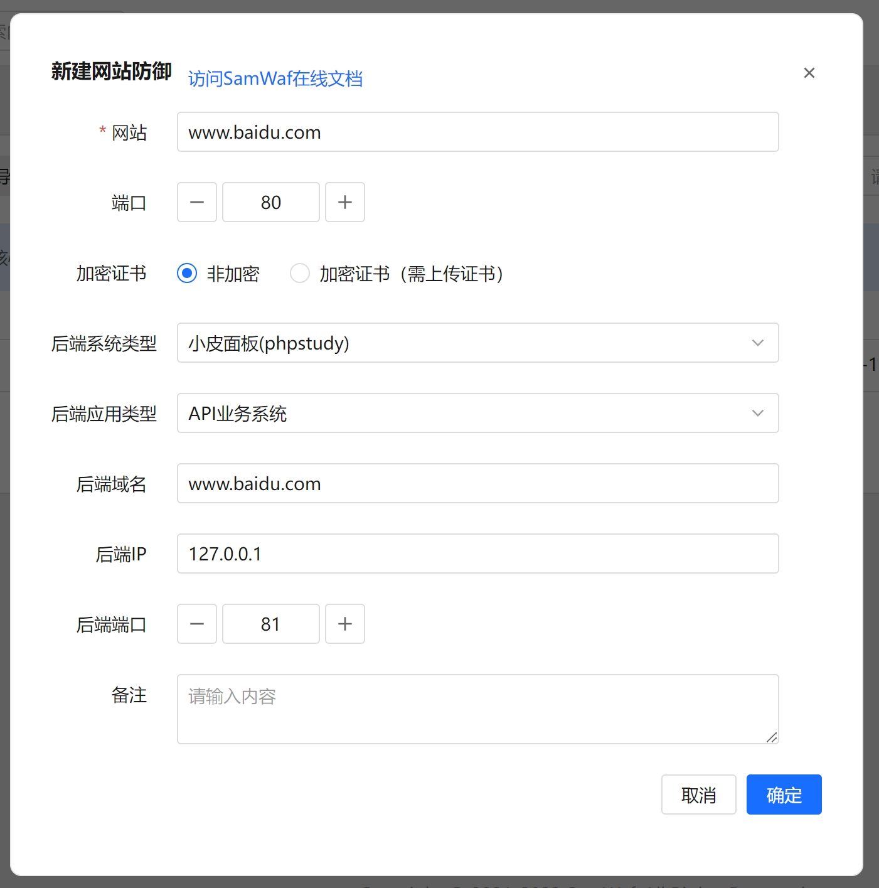</td>
        <td>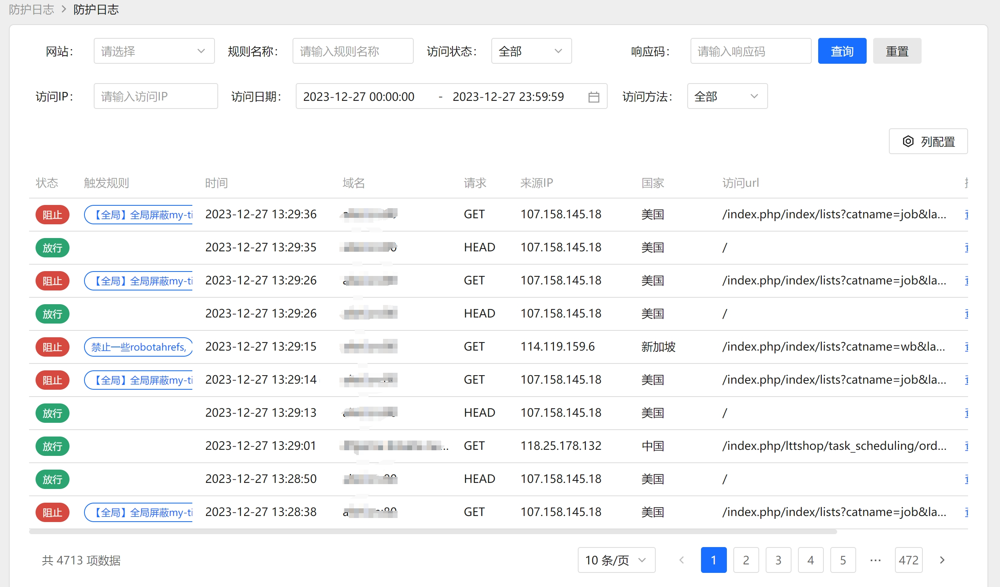</td>
    </tr>
    <tr>
        <td align="center">CC</td>
        <td align="center">IP黑名单</td>
    </tr>
    <tr>
        <td>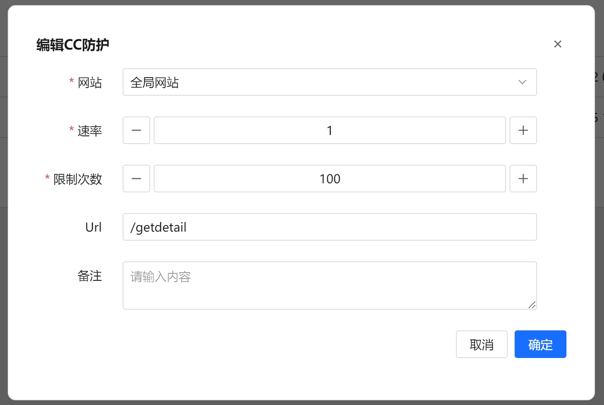</td>
        <td>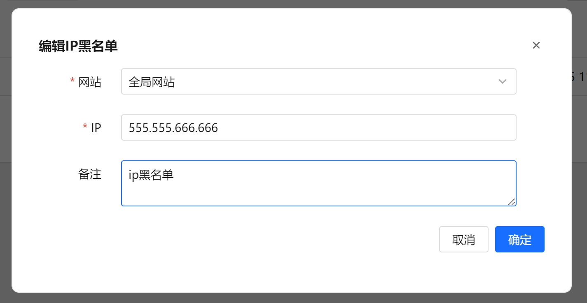</td>
    </tr>
    <tr>
        <td align="center">IP白名单</td>
        <td align="center">LDP</td>
    </tr>
    <tr>
        <td>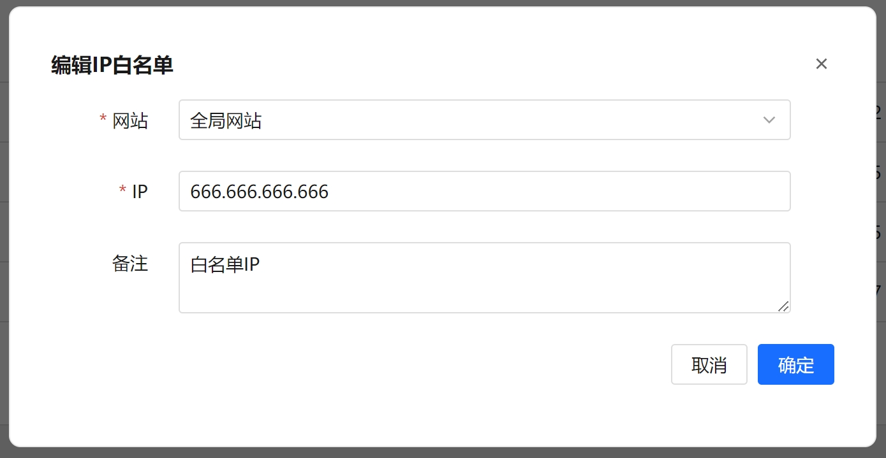</td>
        <td>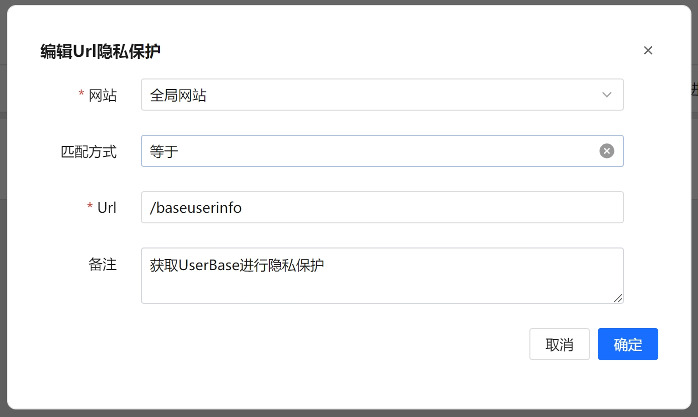</td>
    </tr>
    <tr>
        <td align="center">添加规则脚本日志</td>
        <td align="center">选择日志</td>
    </tr>
    <tr>
        <td>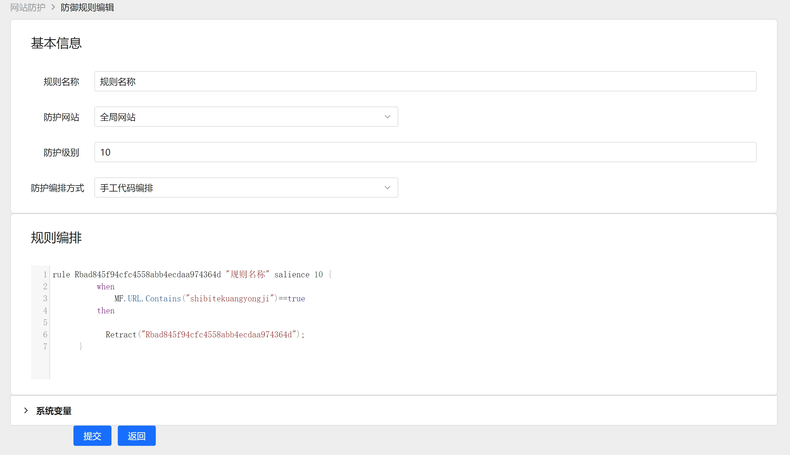</td>
        <td>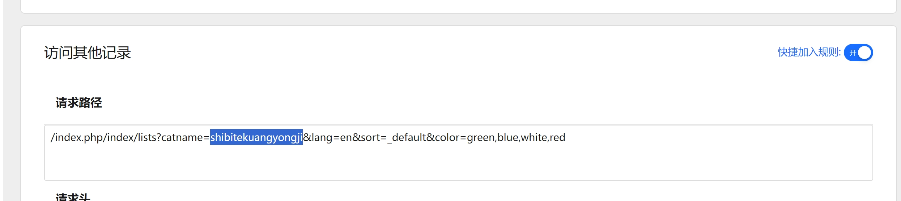</td>
    </tr>
    <tr>
        <td align="center">日志详情</td>
        <td align="center">手动规则</td>
    </tr>
    <tr>
        <td>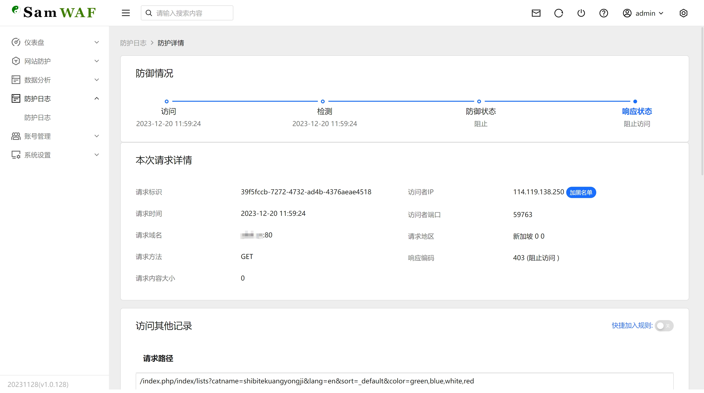</td>
        <td>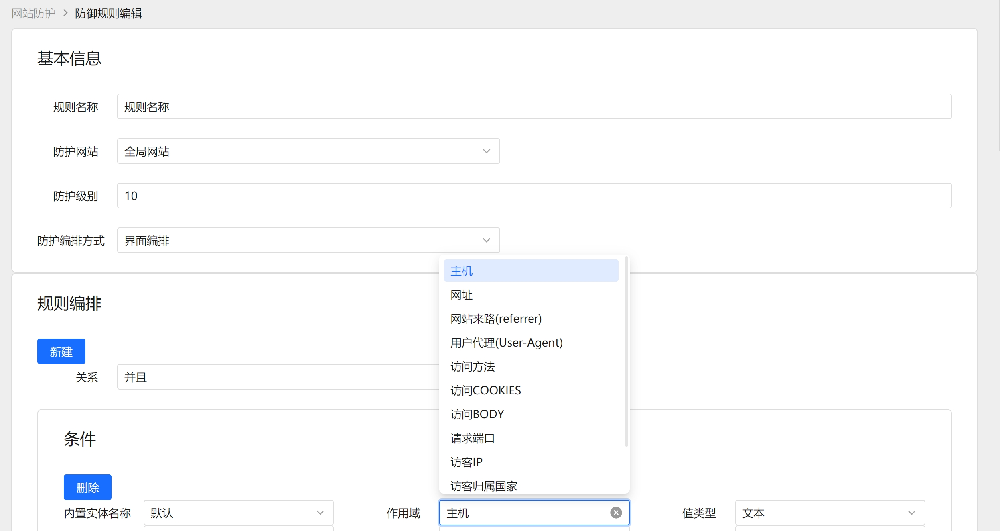</td>
    </tr>
    <tr>
        <td align="center">URL黑名单</td>
        <td align="center">URL白名单</td>
    </tr>
    <tr>
        <td>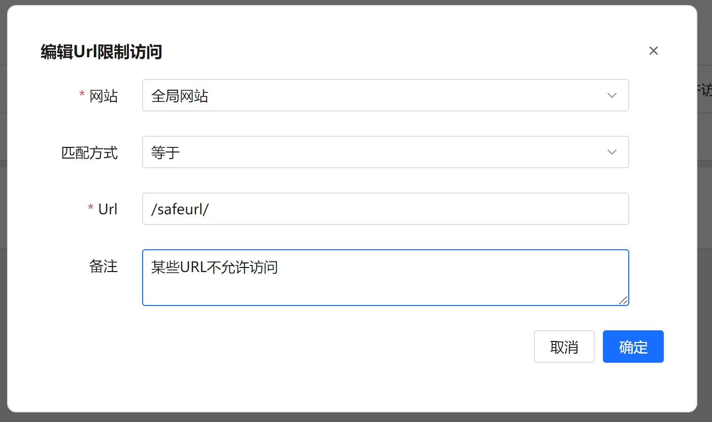</td>
        <td>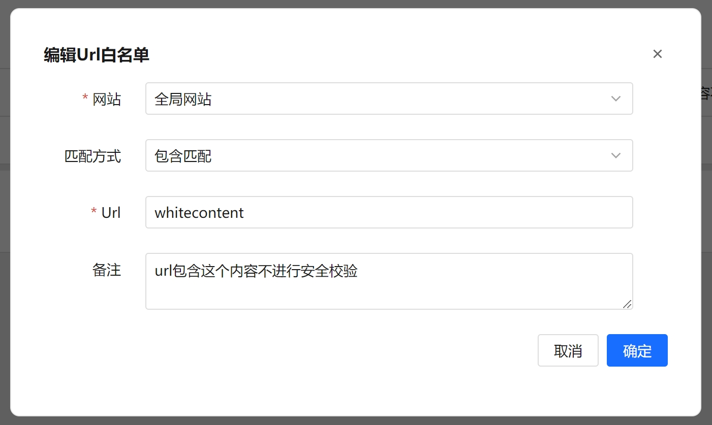</td>
    </tr>
</table>


## 主要功能

### 基础特性
- 代码完全开源（Apache 2.0）
- 完全私有化部署，数据加密后仅保存本地
- 单文件一键启动，轻量化不依赖三方服务（MySQL/Redis 均为可选）
- 完全独立引擎，防护功能不依赖 IIS、Nginx
- 支持 IPV6

### 流量接入
- 支持 HTTP/1.1、HTTP/2、HTTP/3（QUIC）
- 支持 WebSocket 转发
- 反向代理与负载均衡（加权轮询、IP Hash、最小连接数），后端健康检查自动摘除异常节点
- 路径规则：按路径反向代理、静态文件、301/302 重定向，可指定后端协议与响应超时
- 静态站点伺服
- TCP/UDP 四层隧道转发（支持 IP 访问控制、时间段控制）
- 网页缓存加速
- HTTP Basic Auth 站点访问认证
- 支持自定义拦截界面

### 攻击防护
- SQL 注入检测
- XSS 跨站脚本检测
- RCE 远程命令执行检测
- 扫描器工具识别
- 目录穿越检测
- 文件上传检测（危险扩展名、Webshell 特征、伪装 Content-Type）
- CC 频率限制
- 虚假爬虫/Bot 识别（搜索引擎爬虫反向 DNS 验真）
- 防盗链
- CSRF 防护（按站点 Origin/Referer 校验）
- 敏感词过滤
- 支持 OWASP CRS 规则集（Coraza 引擎，规则可启停/覆盖）
- 自定义防护规则，支持脚本和界面编辑
- 人机验证：点选验证码、Cap.js 工作量证明
- 仅记录模式：命中攻击只记录不拦截，便于观察调优规则

### 访问控制
- 支持 IP 黑/白名单
- 支持 URL 黑/白名单
- 地区封禁（内置 ip2region/GeoIP2 离线库，支持 IPv4/IPv6）
- 联动操作系统防火墙封禁 IP
- IP 失败次数达到阈值自动联动封禁
- 支持全局一键配置，支持分网站单独防护策略

### 数据安全
- 日志加密保存
- 通讯日志加密
- 信息脱敏保存（DLP），支持指定界面数据隐私输出
- 网页防篡改（基线学习 + 自动恢复）
- Cookie 安全加固（HttpOnly/Secure/SameSite）

### SSL 证书
- 自动 SSL 证书申请以及续签（ACME，支持多 CA 与 EAB）
- SNI 多证书、多端口 HTTPS
- SSL 证书批量检测到期情况
- 证书文件自动加载

### 运维管理
- 账号 RBAC 权限、OTP 双因素认证、登录/操作日志
- 数据统计报表、系统/主机监控
- 数据保留策略与日志自动分片归档
- 默认 SQLite（加密），可选 MySQL / PostgreSQL，内置 SQLite→MySQL / SQLite→PostgreSQL / MySQL→PostgreSQL 一键迁移
- 在线一键升级、零停机滚动重启、版本回退
- 批量任务、定时任务、数据备份
- 开放 API

### 通知告警
- 支持邮件、钉钉、飞书、企业微信、Server酱、Webhook、Kafka、RabbitMQ、日志文件等通知/投递渠道


# 使用说明
**强烈建议您在测试环境测试充分在上生产，如遇到问题请及时反馈**
## 下载最新版本
gitee:  [https://gitee.com/samwaf/SamWaf/releases](https://gitee.com/samwaf/SamWaf/releases)

github: [https://github.com/samwafgo/SamWaf/releases](https://github.com/samwafgo/SamWaf/releases)

atomgit: [https://atomgit.com/SamSafe/SamWaf/releases](https://atomgit.com/SamSafe/SamWaf/releases)

## 快速启动
### Windows
- 直接启动
```
SamWaf64.exe
```
- 服务形式(安装服务需以管理员身份运行cmd)
```
//安装并启动
SamWaf64.exe install && SamWaf64.exe start

//停止并卸载
SamWaf64.exe stop && SamWaf64.exe uninstall
```

### Linux

- Linux 一键自动下载并安装脚本
```
curl -sSO https://update.samwaf.com/latest/install_samwaf.sh && bash install_samwaf.sh install 
``` 

- Linux 一键卸载脚本
```
curl -sSO https://update.samwaf.com/latest/install_samwaf.sh && bash install_samwaf.sh uninstall 
```


### Docker
```
docker run -d --name=samwaf-instance \
           --restart always \
           -p 26666:26666 \
           -p 80:80 \
           -p 443:443 \
           -v /path/to/your/conf:/app/conf \
           -v /path/to/your/data:/app/data \
           -v /path/to/your/logs:/app/logs \
           -v /path/to/your/ssl:/app/ssl \
           samwaf/samwaf


```
更多docker启动上面的解释  https://hub.docker.com/r/samwaf/samwaf

标签
- latest :最新正式版本（建议生产使用）   
- beta: 最新测试版本（可以在测试体验最新特性，或修正特定bug）

### 命令行工具

| 命令 | 说明 |
|------|------|
| `install` / `uninstall` | 安装 / 卸载系统服务 |
| `start` / `stop` / `restart` | 启动 / 停止 / 重启服务 |
| `rolling-restart` | 零停机滚动重启（切换 Worker，业务不中断） |
| `resetpwd` | 重置管理员密码 |
| `resetotp` | 重置安全码（OTP） |
| `repairdb` | 修复损坏的数据库 |
| `execsql` | 在指定数据库上执行 SQL 语句 |
| `migratedb` | 离线迁移数据库 SQLite → MySQL / SQLite → PostgreSQL / MySQL → PostgreSQL（`--dry-run` 只做预估，`--force` 强制覆盖） |
| `rollback` | 回退到历史备份版本 |

示例：`SamWaf64.exe resetpwd`（Linux 对应 `./SamWafLinux64 resetpwd`）

## 启动访问

http://127.0.0.1:26666

默认帐号：admin  初始密码：全新安装会自动生成随机密码并保存到 `data/initial_password.txt`（存量安装沿用原密码；请首次登录后立即修改）

## 升级指南

**注意:升级过程会终止服务,请在闲时进行升级。**

### 自动升级
如有新版本页面会弹出升级框进行确认即可发起升级，升级完毕后，页面会自动刷新。
### 手动升级
- 对于直接启动方式

关闭应用，下载最新程序替换,再手工启动就可以了。

- 对于以服务形式
```
1.先暂停服务

  windows: SamWaf64.exe stop
  linux: ./SamWafLinux64 stop
  
2.替换最新应用文件

3.启动
windows: SamWaf64.exe start
linux: ./SamWafLinux64 start
```

PS:windows服务形式升级时候貌似会触发360、火绒规则导致无法正常替换新文件。此时可以手工替换。
熟悉这方面的朋友可以帮看下正确方式怎么处理。

## 在线文档

[在线文档](https://doc.samwaf.com/)

# 代码相关
## 代码托管
- gitee
[https://gitee.com/samwaf/SamWaf](https://gitee.com/samwaf/SamWaf)
- github
[https://github.com/samwafgo/SamWaf](https://github.com/samwafgo/SamWaf)
- atomgit
[https://atomgit.com/SamSafe/SamWaf](https://atomgit.com/SamSafe/SamWaf)

## 介绍和编译
How to compile
[编译说明](./docs/compile.md)

在线编译手册：
[https://doc.samwaf.com/dev/](https://doc.samwaf.com/dev/)

## 已测试支持的平台
[已测试支持的平台](./docs/Tested_supported_systems.md)

## 其它信息

- [更新IP数据库](./docs/ipmodify.md)
 
## 测试效果
[测试效果](./test/attackTest.md)

# 安全策略
[安全策略](./SECURITY.md)

# 问题反馈
当前 SamWaf 还正在不停迭代,欢迎大家反馈问题、提出意见

- [gitee issues](https://gitee.com/samwaf/SamWaf/issues)
- [github issues](https://github.com/samwafgo/SamWaf/issues)
- [atomgit issues](https://atomgit.com/SamSafe/SamWaf/issues)
- 邮件反馈:samwafgo@gmail.com

# 微信公众号

 

## Star 历史趋势

[](https://star-history.com/#samwafgo/samwaf&Date)

# 许可证书
SamWaf 采用 Apache 2.0 license. 详细见 [LICENSE](./LICENSE) .

第三方软件使用声明，见[ThirdLicense](./ThirdLicense)
 
# 贡献代码
 感谢以下小伙伴对本仓库的贡献!

<a href="https://github.com/samwafgo/SamWaf/graphs/contributors">
  
</a>
