[English](README.md) | [简体中文](README_cn.md) | [Español](README_es.md) | [हिन्दी](README_hi.md) | [العربية](README_ar.md) | [Français](README_fr.md) | [Português](README_pt.md) | [Русский](README_ru.md) | [বাংলা](README_bn.md) | [اردو](README_ur.md) | [日本語](README_ja.md) | [Deutsch](README_de.md) | [Bahasa Indonesia](README_id.md) | [한국어](README_ko.md)


<div align="center">
  

경량 오픈소스 웹 애플리케이션 방화벽

[](https://github.com/samwafgo/SamWaf/releases)
[](https://github.com/samwafgo/SamWaf/releases)
[](https://hub.docker.com/r/samwaf/samwaf)
[](https://github.com/samwafgo/SamWaf/releases)
[](https://gitee.com/samwaf/SamWaf)
[](https://github.com/samwafgo/SamWaf)
[](https://gitee.com/samwaf/SamWaf)
[](https://atomgit.com/SamSafe/SamWaf)
[](LICENSE)
</div>

  
## 개발 동기:
- **경량화**: 처음에는 nginx, apache, iis 플러그인 기반의 보안 제품으로 보호를 구성했지만, 플러그인 방식은 결합도가 높았습니다.
- **프라이빗 배포**: 이후에는 대부분 클라우드 보호 서비스를 도입했지만, 프라이빗 배포는 중대형 기업에서나 감당할 수 있는 비용이라 소규모 회사와 스튜디오에게는 부담이 큽니다.
- **프라이버시 암호화**: 웹 보호 과정에서 데이터를 클라우드로 보내지 않고 로컬에서 처리하는 것이 바람직합니다. 로컬 정보와 관리 콘솔의 네트워크 통신을 암호화하는 도구를 만드는 것이 목표였습니다.
- **DIY**: 수년간 웹사이트를 유지보수하고 개발하면서 추가하고 싶었지만 구현하지 못했던 기능들이 있었습니다.
- **가시성**: 웹마스터가 유사한 WAF를 사용해 본 적이 없다면, 로그나 nginx, apache, IIS 등만으로는 누가 사이트에 접근하고 어떤 요청을 보내는지 파악하기 어렵습니다.

요컨대, 웹사이트나 API를 보호하는 효과적인 도구를 만들어 비정상 상황에 대응하고 웹사이트와 애플리케이션의 정상적인 운영을 보장하는 것이 목표였습니다.

# 소프트웨어 소개
SamWaf는 소규모 회사, 스튜디오, 개인 웹사이트를 위한 경량 오픈소스 웹 애플리케이션 방화벽입니다. 완전한 프라이빗 배포를 지원하고, 데이터를 암호화하여 로컬에 저장하며, 손쉽게 시작할 수 있고, Linux, Windows 64비트 및 ARM64를 지원하며 Docker 이미지도 제공됩니다. 기본적으로 외부 의존성이 전혀 없는 내장 암호화 SQLite 데이터베이스를 사용하며, 필요에 따라 MySQL / PostgreSQL로 전환할 수 있습니다.

## 아키텍처

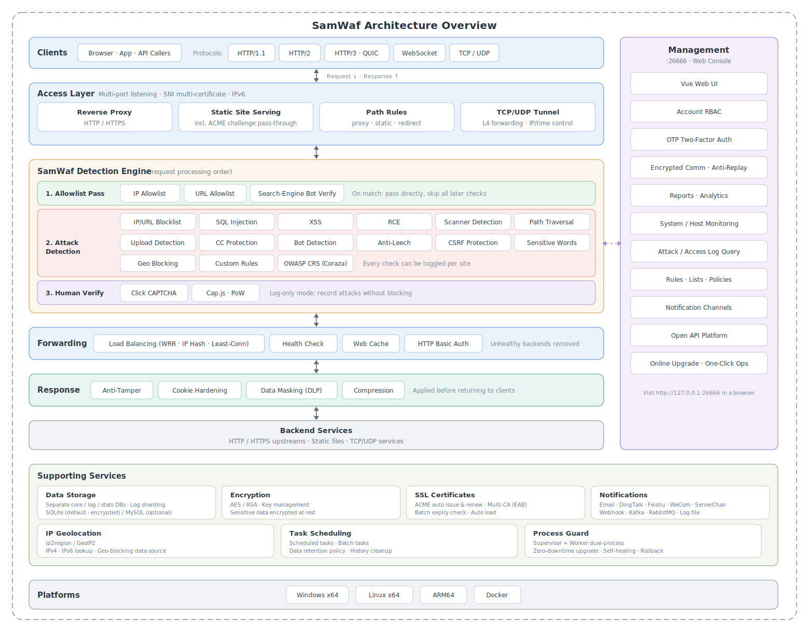

## 인터페이스


<table>
    <tr>
        <td align="center">호스트 추가</td>
        <td align="center">공격 로그</td>
    </tr>
    <tr>
        <td>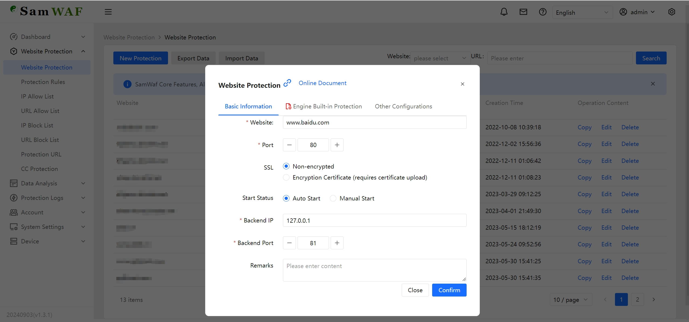</td>
        <td>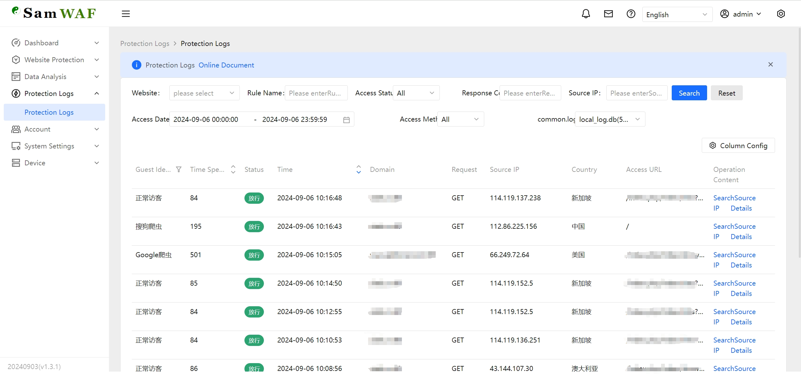</td>
    </tr>
    <tr>
        <td align="center">CC</td>
        <td align="center">IP 차단 목록</td>
    </tr>
    <tr>
        <td>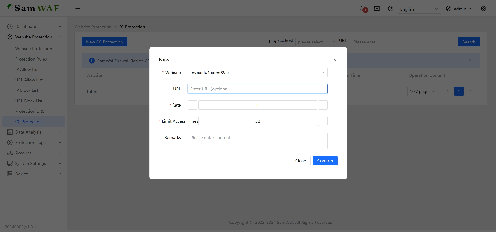</td>
        <td>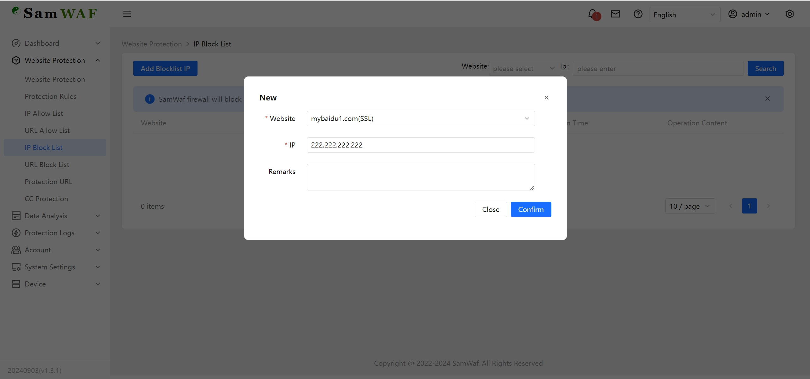</td>
    </tr>
    <tr>
        <td align="center">IP 허용 목록</td>
        <td align="center">LDP</td>
    </tr>
    <tr>
        <td>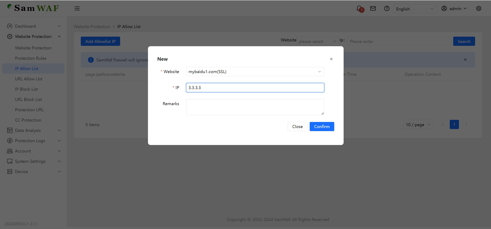</td>
        <td>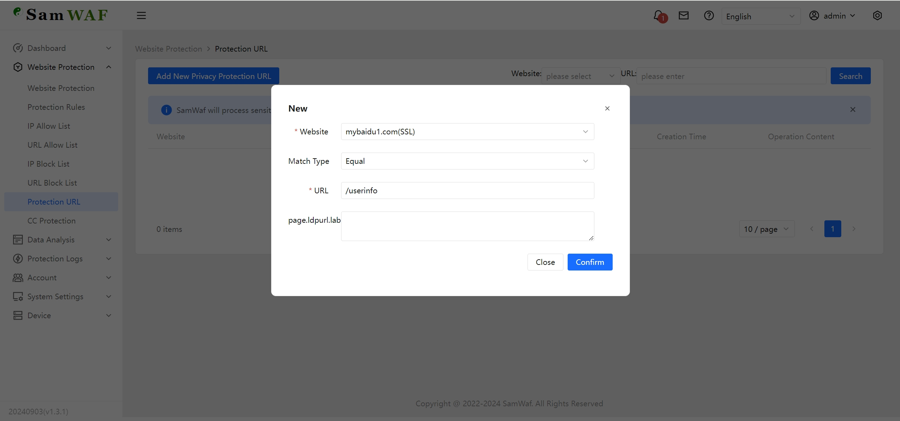</td>
    </tr>
    <tr>
        <td align="center">규칙 스크립트 추가 로그</td>
        <td align="center">로그 선택</td>
    </tr>
    <tr>
        <td>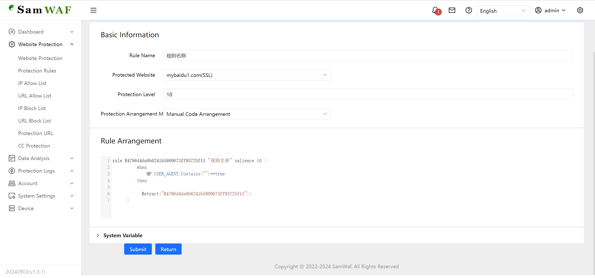</td>
        <td>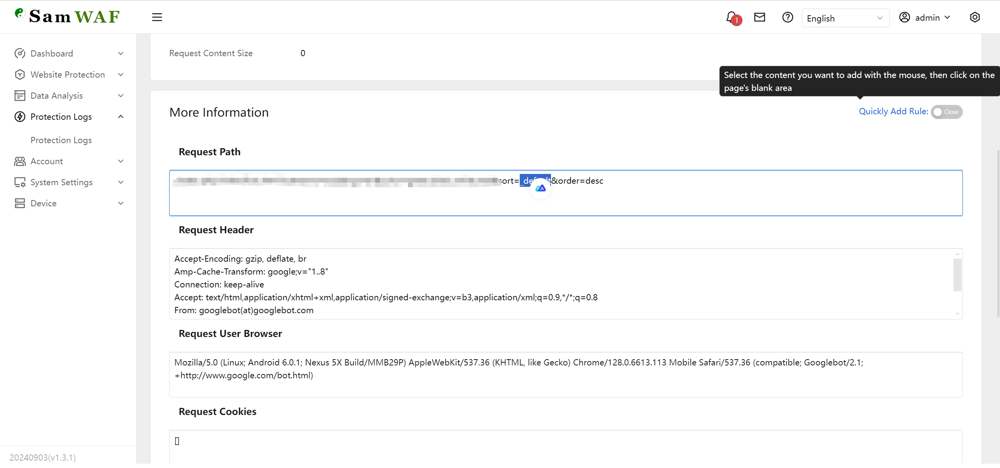</td>
    </tr>
    <tr>
        <td align="center">로그 상세</td>
        <td align="center">수동 규칙</td>
    </tr>
    <tr>
        <td>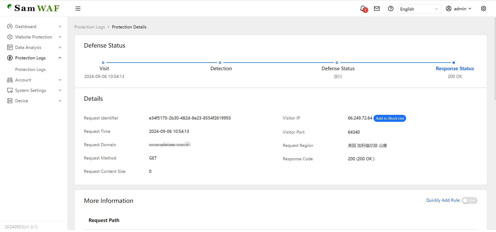</td>
        <td>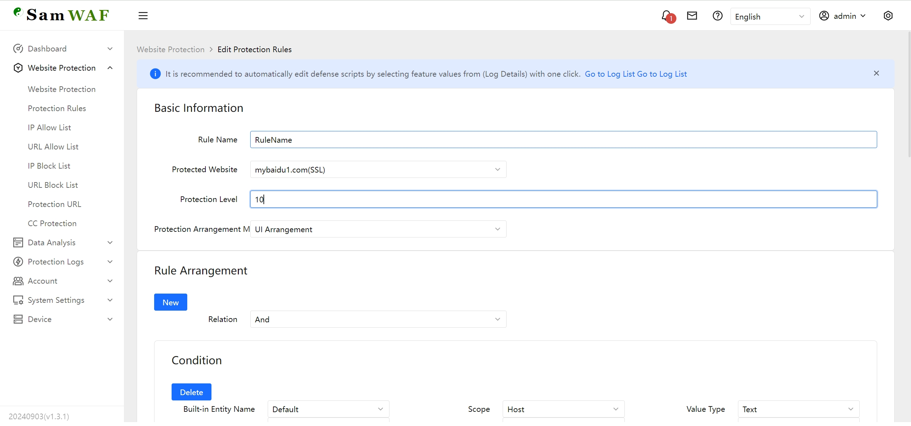</td>
    </tr>
    <tr>
        <td align="center">URL 차단 목록</td>
        <td align="center">URL 허용 목록</td>
    </tr>
    <tr>
        <td>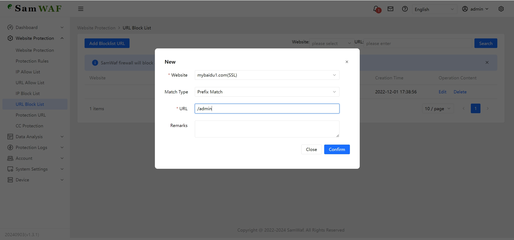</td>
        <td>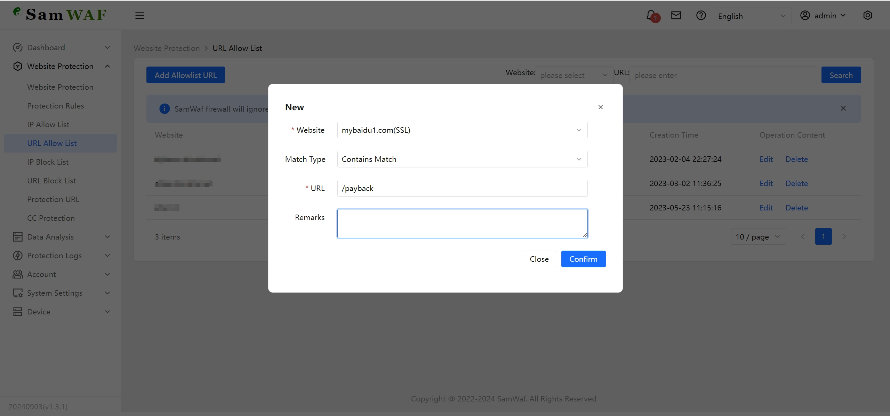</td>
    </tr>
</table>

## 주요 기능

### 기본 기능
- 완전한 오픈소스 코드 (Apache 2.0)
- 완전한 프라이빗 배포, 데이터는 암호화되어 로컬에만 저장
- 단일 파일 원클릭 실행, 서드파티 서비스 의존성이 없는 경량 구조 (MySQL/Redis는 선택 사항)
- 완전히 독립적인 엔진, 보호 기능이 IIS나 Nginx에 의존하지 않음
- IPv6 지원

### 트래픽 인입
- HTTP/1.1, HTTP/2 및 HTTP/3 (QUIC) 지원
- WebSocket 포워딩
- 로드 밸런싱을 갖춘 리버스 프록시 (가중 라운드 로빈, IP 해시, 최소 연결), 헬스 체크로 비정상 백엔드 자동 제거
- 경로 규칙: 경로별 리버스 프록시, 정적 파일 또는 301/302 리다이렉트, 백엔드 프로토콜과 응답 타임아웃 설정 가능
- 정적 사이트 서빙
- TCP/UDP 4계층 터널 포워딩 (IP 접근 제어 및 시간대 제어 지원)
- 웹 페이지 캐싱
- 사이트 접근용 HTTP Basic Auth
- 사용자 정의 가능한 차단 페이지

### 공격 방어
- SQL 인젝션 탐지
- XSS (크로스 사이트 스크립팅) 탐지
- RCE (원격 명령 실행) 탐지
- 스캐너 도구 탐지
- 디렉터리 트래버설 탐지
- 파일 업로드 탐지 (위험 확장자, 웹셸 시그니처, 위조된 Content-Type)
- CC / 속도 제한 보호
- 가짜 크롤러/봇 탐지 (검색 엔진 봇의 역방향 DNS 검증)
- 핫링크 방지 (Anti-leech)
- CSRF 보호 (사이트별 Origin/Referer 검증)
- 민감 단어 필터링
- OWASP CRS 규칙 세트 지원 (Coraza 엔진, 규칙 활성화/비활성화/재정의 가능)
- 스크립트와 GUI 편집을 모두 지원하는 사용자 정의 보호 규칙
- 휴먼 검증: 클릭 CAPTCHA 및 Cap.js 작업 증명(Proof-of-Work)
- 로그 전용 모드: 차단 없이 공격만 기록하여 규칙 관찰 및 튜닝에 유용

### 접근 제어
- IP 허용 목록 / 차단 목록
- URL 허용 목록 / 차단 목록
- 지역 기반 차단 (내장 오프라인 ip2region/GeoIP2 데이터베이스, IPv4/IPv6)
- OS 방화벽 연동 IP 차단
- IP 실패 횟수가 임계값에 도달하면 자동 차단
- 전역 원클릭 설정 및 사이트별 보호 전략

### 데이터 보안
- 암호화된 로그 저장
- 암호화된 통신 로그
- 지정된 데이터 프라이버시 출력을 지원하는 데이터 마스킹 (DLP)
- 웹 페이지 변조 방지 (기준선 학습 + 자동 복구)
- 쿠키 보안 강화 (HttpOnly/Secure/SameSite)

### SSL 인증서
- SSL 인증서 자동 발급 및 갱신 (ACME, EAB를 지원하는 멀티 CA)
- SNI 다중 인증서 및 다중 포트 HTTPS
- SSL 인증서 만료 일괄 점검
- 인증서 자동 로딩

### 운영 및 관리
- 계정 RBAC, OTP 2단계 인증, 로그인/작업 로그
- 통계 리포트 및 시스템/호스트 모니터링
- 자동 로그 샤딩과 아카이빙을 갖춘 데이터 보존 정책
- 기본 SQLite (암호화), 선택적 MySQL / PostgreSQL, 내장 SQLite→MySQL / SQLite→PostgreSQL / MySQL→PostgreSQL 마이그레이션 도구 제공
- 온라인 원클릭 업그레이드, 무중단 롤링 재시작, 버전 롤백
- 배치 작업, 예약 작업, 데이터 백업
- 오픈 API

### 알림
- 이메일, DingTalk, Feishu, WeCom (WeChat Work), ServerChan, Webhook, Kafka, RabbitMQ 및 로그 파일 전송 채널

# 사용 방법
**프로덕션에 배포하기 전에 테스트 환경에서 충분히 테스트할 것을 강력히 권장합니다. 문제가 발생하면 즉시 피드백을 보내 주시기 바랍니다.**
## 최신 버전 다운로드
Gitee:  [https://gitee.com/samwaf/SamWaf/releases](https://gitee.com/samwaf/SamWaf/releases)

GitHub: [https://github.com/samwafgo/SamWaf/releases](https://github.com/samwafgo/SamWaf/releases)

AtomGit: [https://atomgit.com/SamSafe/SamWaf/releases](https://atomgit.com/SamSafe/SamWaf/releases)

## 빠른 시작

### Windows
- 직접 시작
```
SamWaf64.exe
```
- 서비스로 실행 (관리자 권한 필요)
```
//Install & Start
SamWaf64.exe install && SamWaf64.exe start

//Stop &  Uninstall 
SamWaf64.exe stop && SamWaf64.exe uninstall
``` 

### Linux
- 설치
```
curl -sSO https://update.samwaf.com/latest/install_samwaf.sh && bash install_samwaf.sh install 
``` 

- 제거
```
curl -sSO https://update.samwaf.com/latest/install_samwaf.sh && bash install_samwaf.sh uninstall 
```

### Docker
```
docker run -d --name=samwaf-instance \
           --restart always \
           -p 26666:26666 \
           -p 80:80 \
           -p 443:443 \
           -v /path/to/your/conf:/app/conf \
           -v /path/to/your/data:/app/data \
           -v /path/to/your/logs:/app/logs \
           -v /path/to/your/ssl:/app/ssl \
           samwaf/samwaf


```
Docker 상세 정보: https://hub.docker.com/r/samwaf/samwaf

태그:
- **latest**: 최신 안정 릴리스 (프로덕션 사용 권장).
- **beta**: 최신 테스트 버전 (새 기능이나 특정 버그 수정을 테스트할 수 있음).

### 명령줄 도구

| Command | 설명 |
|---------|-------------|
| `install` / `uninstall` | 시스템 서비스 설치 / 제거 |
| `start` / `stop` / `restart` | 서비스 시작 / 중지 / 재시작 |
| `rolling-restart` | 무중단 롤링 재시작 (트래픽 중단 없이 워커 교체) |
| `resetpwd` | 관리자 비밀번호 재설정 |
| `resetotp` | 보안 코드(OTP) 재설정 |
| `repairdb` | 손상된 데이터베이스 복구 |
| `execsql` | 선택한 데이터베이스에서 SQL 문 실행 |
| `migratedb` | SQLite → MySQL / SQLite → PostgreSQL / MySQL → PostgreSQL 오프라인 데이터베이스 마이그레이션 (`--dry-run`은 예상치만 산출, `--force`는 덮어쓰기) |
| `rollback` | 이전 백업 버전으로 롤백 |

예시: `SamWaf64.exe resetpwd` (Linux의 경우: `./SamWafLinux64 resetpwd`)

## 접속 시작

http://127.0.0.1:26666

기본 계정: admin  초기 비밀번호: 새로 설치하면 임의의 비밀번호가 자동 생성되어 `data/initial_password.txt` 파일에 저장됩니다 (기존 설치는 이전 비밀번호를 유지합니다; 첫 로그인 시 즉시 변경하세요)


## 업그레이드 가이드

**참고: 업그레이드 과정에서 서비스가 종료되므로, 트래픽이 적은 시간대에 업그레이드하시기 바랍니다.**

### 자동 업그레이드
새 버전이 있으면 확인을 위한 업그레이드 안내 창이 표시되며, 이를 통해 업그레이드를 시작할 수 있습니다. 업그레이드가 완료되면 페이지가 자동으로 새로 고침됩니다.

### 수동 업그레이드
- 직접 실행하는 경우:
    1. 애플리케이션을 종료합니다.
    2. 최신 프로그램을 다운로드하여 기존 파일을 교체한 후 수동으로 다시 시작합니다.

- 서비스 모드의 경우:
```
1. First, pause the service.

  Windows: SamWaf64.exe stop
  Linux: ./SamWafLinux64 stop
  
2. Replace with the latest application files.

3. Start the service:
Windows: SamWaf64.exe start
Linux: ./SamWafLinux64 start
```

**참고**: Windows 서비스를 업그레이드할 때 360 또는 Huorong의 보안 규칙이 작동하여 새 파일이 정상적으로 교체되지 않을 수 있습니다. 이 경우 파일을 수동으로 교체하면 됩니다. 이 분야에 익숙하신 분들은 올바른 처리 방법을 찾는 데 도움을 주실 수 있습니다.

## 온라인 문서

[온라인 문서](https://doc.samwaf.com/)

# 코드 정보
## 코드 저장소
- Gitee
[https://gitee.com/samwaf/SamWaf](https://gitee.com/samwaf/SamWaf)
- GitHub
[https://github.com/samwafgo/SamWaf](https://github.com/samwafgo/SamWaf)
- Atomgit
[https://atomgit.com/SamSafe/SamWaf](https://atomgit.com/SamSafe/SamWaf)

## 소개 및 컴파일
컴파일 방법
[컴파일 안내](./docs/compile.md)

온라인 컴파일 매뉴얼：
[https://doc.samwaf.com/en/dev/](https://doc.samwaf.com/en/dev/)

## 테스트 및 지원 플랫폼
[테스트 및 지원 플랫폼](./docs/Tested_supported_systems.md)

## 기타 정보 

- [IP 데이터베이스 업데이트](./docs/ipmodify.md)

## 테스트 결과
[테스트 결과](./test/attackTest.md)

# 보안 정책
[보안 정책](./SECURITY.md)

# 피드백
SamWaf는 지속적으로 발전하고 있습니다. 피드백과 제안을 환영합니다.

- [Gitee 이슈](https://gitee.com/samwaf/SamWaf/issues)
- [GitHub 이슈](https://github.com/samwafgo/SamWaf/issues)
- [Atomgit 이슈](https://atomgit.com/SamSafe/SamWaf/issues)
- 이메일 피드백: samwafgo@gmail.com

# WeChat 공식 계정

 

## Star 히스토리

[](https://star-history.com/#samwafgo/samwaf&Date)


#  라이선스
SamWaf는 Apache License 2.0 라이선스에 따라 배포됩니다. 자세한 내용은 [LICENSE](./LICENSE)를 참고하십시오.

서드파티 소프트웨어 사용 고지는 [ThirdLicense](./ThirdLicense)를 참고하십시오.

# 기여
 다음 기여자분들께 감사드립니다!

<a href="https://github.com/samwafgo/SamWaf/graphs/contributors">
  
</a>
