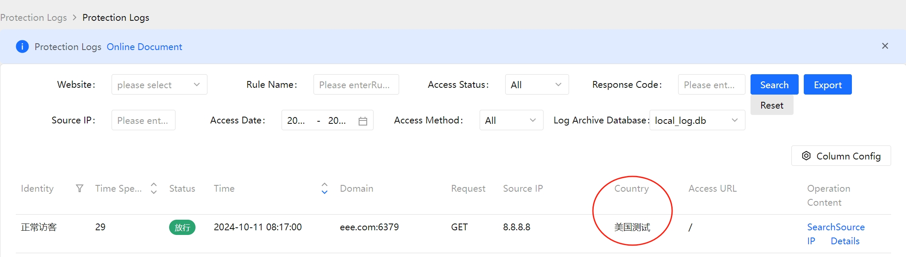

# ip 库的处理

## 机制

1. SamWaf 为了轻量化，**只内置了 IPv4 的 `ip2region.xdb`**（Apache-2.0）。
2. **IPv6 地区库不随程序内置**：`ip2region_v6.xdb` 约 35MB，内嵌会让二进制过大。
3. **GeoLite2 也不再随程序内置**：MaxMind 对 GeoLite2 再分发另有授权要求，
   把它编进发行的二进制等同于再分发。需要用 GeoLite2 的用户可自行到 MaxMind 官网下载后上传，程序照常加载。
4. 加载优先级：**`data/` 下的文件 > 内置数据 > 同类型的其它可用来源（运行时降级）**。
   也就是说只要你把文件放进 `data/`，用的就是你的文件。
5. 没有任何可用地区库时，程序**照常启动、照常防护**，只是归属地显示为未知；
   此时地区类自定义规则（引用 `MF.COUNTRY` / `MF.PROVINCE` / `MF.CITY` 的规则）对该请求**不生效**，
   以免 `MF.COUNTRY != "中国"` 这类规则在没有地区数据时把访客整片误拦。

## 各数据文件对照

| 文件名（放在 `data/` 下） | 用途 | 是否内置 | 获取方式 |
|---|---|:--:|---|
| `ip2region.xdb` | IPv4 地区 | ✅ 内置 | 内置即可用；也可自行替换 |
| `ip2region_v6.xdb` | IPv6 地区 | ❌ | 管理端【IP库管理 → 在线下载】，或手动下载 |
| `GeoLite2-Country.mmdb` | IPv4/IPv6 国家 | ❌ | 自行到 MaxMind 官网下载后上传 |
| `iplocation.ipdb` | IPv4+IPv6（同一文件） | ❌ | 自行获取后上传 |

## 获取 IPv6 地区库

### 方式一：管理端在线下载（推荐）

【IP库管理】→【在线下载】→ 点「检查更新」→ 对 `ip2region IPv6 地区库` 点「下载并启用」。
下载完成后自动热加载，**无需重启**。

### 方式二：手动下载放入 data 目录（官方源慢时推荐）

1. 从上游仓库下载 `ip2region_v6.xdb`（IPv6）或 `ip2region.xdb`（IPv4）：
   - Gitee：https://gitee.com/lionsoul/ip2region/tree/master/data
   - GitHub：https://github.com/lionsoul2014/ip2region/tree/master/data
2. 上传到服务器上 **SamWaf 程序目录下的 `data/`**，**文件名保持不变**。
   管理端【IP库管理 → 在线下载】页面会直接显示这台服务器上的绝对路径，可一键复制。
3. 回到管理端点「重新加载」即可生效，**无需重启程序**。

内网 / 离线环境、或官方源速度不理想时都走这种方式。在线下载过程中也可以随时点「取消下载」改用手动。

## ⚠️ 国家名语言差异（会影响地区规则）

**ip2region 官方社区版数据库的国家名是英文，SamWaf 内置的 IPv4 库是中文。**

| 数据来源 | 国家名示例 |
|---|---|
| SamWaf 内置 `ip2region.xdb`（legacy 格式） | `中国`、`美国` |
| 官方社区版 `ip2region_v6.xdb`（opensource 格式） | `China`、`United States` |

地区封禁是靠自定义规则实现的，官方模板长这样：

```
rule Roverseas "海外访问拦截" { when MF.COUNTRY != "中国" then RF.Deny(); }
```

这条规则对**内置 IPv4 库**没问题，但对**社区版 IPv6 库**会失效 ——
中国的 IPv6 访客解析出来是 `China`，`"China" != "中国"` 成立，会被误拦。

**处理建议**：

- 先用管理端【IP库管理】顶部的「测试IP地址」查一下，确认你的库实际返回什么
- 如需同时覆盖中英文，把规则改成两个条件都排除：

```
rule Roverseas "海外访问拦截" {
    when MF.COUNTRY != "中国" && MF.COUNTRY != "China"
    then RF.Deny();
}
```

- 或者统一数据源：IPv4 也换成官方社区版 `ip2region.xdb`（对应格式选 `opensource`），
  这样中英文就不会混用了

## 如何自己生成 ip2region.xdb

遇到识别不准的问题，可以自己构建一份放在 `data/ip2region.xdb`，重启 SamWaf 即可。

这里使用 Ip2region(狮子的魂)。为了方便测试使用，fork了一份，生成了windows和linux的可执行文件。

https://github.com/samwafgo/ip2region/releases

- 1.编辑

下载一份原始ip数据

https://github.com/lionsoul2014/ip2region/blob/master/data/ip.merge.txt


```
xdb_maker.exe edit --src=./ip.merge.txt

```

打开ip.merge.txt ，我们拿8.8.8.8来测试。把这个复制出来：8.8.8.0|8.8.8.255|美国|0|0|0|Level3 ，稍加改动

```

put 8.8.8.0|8.8.8.255|美国测试|0|0|0|Level3

```

- 2.保存

```
save
```


退出xdb_maker

```

quit 

```

- 3.最后生成db文件

```
xdb_maker.exe gen --src=./ip.merge.txt --dst=./ip2region.xdb
```

这个时候会花几分钟时候构建，出现这个就OK了，可以复制ip2region.xdb到data下了

```

2024/10/10 16:17:08 maker.go:283: try to write the vector index block ...
2024/10/10 16:17:08 maker.go:294: try to write the segment index ptr ...
2024/10/10 16:17:08 maker.go:307: write done, dataBlocks: 13828, indexBlocks: (683843, 720464), indexPtr: (983612, 11070094)
2024/10/10 16:17:08 main.go:112: Done, elapsed: 2m36.219498s

```

- 4.【可选】 批量测试是否正常：
  会挺慢几分钟
```

xdb_maker.exe bench --db=./ip2region.xdb --src=./ip.merge.txt

```


``` 
|-try to bench ip '224.0.0.0' ...  --[Ok]
|-try to bench ip '247.255.255.255' ...  --[Ok]
|-try to bench ip '239.255.255.255' ...  --[Ok]
|-try to bench ip '247.255.255.255' ...  --[Ok]
|-try to bench ip '255.255.255.255' ...  --[Ok]
Bench finished, {count: 3419215, failed: 0, took: 3m48.3903262s}
```

 
## 查询相关

- 1.替换后 通过日志查看
 



- 2.测试数据库查询是否正常，也可以用工具先看看：

xdb_searcher.exe search --db=./ip2region.xdb

```

iptest>xdb_searcher.exe search --db=./ip2region.xdb
ip2region xdb searcher test program, cachePolicy: vectorIndex
type 'quit' to exit
ip2region>> 8.8.8.8
{region: 美国测试|0|0|0|Level3, ioCount: 7, took: 617.7µs}
ip2region>> quit
searcher test program exited, thanks for trying

```